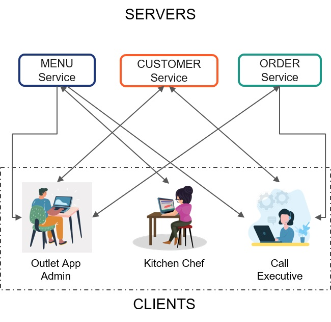

## Challenge - Wat-a-Pizza

#### Problem Statement

Wat-a-pizza is a pizza delivery joint that became popular for its custom-made vegetarian pizzas. 

A customer can call the joint and order pizzas and other accompaniments. The joint delivers the orders received on call at the address specified by the customer.

Write API specification in JSON format to make requests to APIs for menu, customers and orders.

#### Context 

With the growing popularity, Wat-a-Pizza joint owners are getting a web application developed.

The client-end of the web application is accessed by multiple teams of users.

Different teams are given different permissions to make requests.
- For e.g., kitchen team can add, update, modify, delete menu details and view items ordered
- Call executive team can work with customers and orders data
- Admin has access to all the data

Also, the server-end of the web application servers to the requests through multiple services.

Like, there is a separate service for serving to requests for menu items, customer details and orders



To ensure the server handles all the requirements of the client app, the developer team at the server should be provided with an API specification by the developer team at the client end.

An API specification is a document that lists down details of requests that can be made to the server and the responses expected.

The API specification should list down the requirements preferably in JSON format since it is language independent.

Each API specification requirement should include

Details for each request that should contain:
- Request URL
- Request Method
- Request Body (wherever applicable)

Details of response expected that should contain
- Response body structure in JSON format
- HTTP Status code for success and failures

Before finalizing the requests in the API specification, the requests and the expected response can be tested by creating fake APIs using json-server and test them using Postman app.

#### Task 1 – Launch APIs Using json-server

- Start `json-server` and launch the APIs (menu, orders, customers) using json files provided in the `api-data` folder of the boilerplate.
- Each api should simultaneously work on different ports
- Following are the expected URLs for menu, customers and orders APIs respectively:
     - http://localhost:3000/menu
     - http://localhost:3001/customers
     - http://localhost:3002/orders
- Use the command `json-server –p <port-number> <filename.json>` to start the `json-server` on specified port.
    - Example: `json-server –p 3001 customers.json`

#### Task 2 – List HTTP Request Response Details for Menu API

- The outlet kitchen team should be allowed to access menu to 
    - Add new menu item
    - Modify details of existing menu item
    - View all menu items
- The call executive team should be allowed to access menu for placing orders.
- The app should allow this team to 
    - View all menu items
    - Filter out menu items by cuisine (Asian / Italian / Mexican / French )
    - Filter out menu items by category (Starters / Beverages / Main Course)
    - View a specific menu item by its id
- For the stated requirements, identify the HTTP Request that can be sent to Menu API and perform the required operation.
- The request details should include the request URL, HTTP method, Content-Type and Body structure for add and update requests.
- Also, specify the expected HTTP status code for success with response body structure in JSON format
- Specify the expected HTTP status codes for failures related to client and server errors.
- Ensure the API request URLs are correctly formed by testing them in Postman.
- List down the request and response details for accessing menu in `menu.csv` file.

#### Task 3 – List HTTP Request Response Details for Customers API

- The admin and the call executive handles customers data. 
- The app should allow these set of users to 
    - View details of all customers
    - Search customer by id, name, email or phone
    - Allow adding details of new customer, if the record does not exist
    - Modify the contact details of an existing customer, based on customer’s request.
- For the stated requirements, identify the HTTP Request that can be sent to Customers API and perform the required operation.
- The request details should include the request URL, HTTP method, Content-Type and Body structure for add and update requests.
- Also, specify the expected HTTP status code for success with response body structure in JSON format
- Specify the expected HTTP status codes for failures related to client and server errors.
- Ensure the API request URLs are correctly formed by testing them in Postman.
- List down the request and response details for accessing customers in `customers.csv` file.

#### Task 4 – List HTTP Request Response Details for Orders API

- The admin and the call executive teams would be handling orders coming from customers over call.
- The app should allow these teams of users to:
    - Accept order details and save them
    - Cancel order if requested by the customer within 15 minutes after the order is placed
    - Modify order, within 20 minutes after the order is placed
    - View all orders 
    - View all orders placed on a specific date
    - View all orders by its delivery status
    - View all orders placed by a specific customer
- For the stated requirements, identify the HTTP Request that can be sent to Orders API and perform the required operation.
- The request details should include the request URL, HTTP method, Content-Type and Body structure for add and update requests.
- Also, specify the expected HTTP status code for success with response body structure in JSON format
- Specify the expected HTTP status codes for failures related to client and server errors.
- Ensure the API request URLs are correctly formed by testing them in Postman.
- List down the request and response details for accessing menu in `orders.csv` file.

#### Task 5 – Create API Specification in JSON Format

- For the listed HTTP request and response details, write API specification in `wat-a-pizza-api-spec.json` file only for `Orders` API.
- Refer to the sample format shown below for creating API specification:
```json
{
    "paths": {
        "/menu": {
            "get":{
                "summary": "",
                "description": "",
                "responses": {
                    "200": {
                        "description": "",
                        "content-type": "",
                        "type": "array",
                        "items":{
                            "menuId": "integer",
                            "itemName": "string",
                            "category": "string",
                            "cuisine": "string",
                            "price": "floating-point"
                        }
                    },
                    "404": {
                        "description": "",
                        "content-type": "",
                        "type": "string",
                        "message": ""
                    }
                }
            }
        },
        "/menu/{id}": {
            "parameter": {
                "id": {
                    "type": "integer",
                    "required": false
                }
            },
            "get":{
                "summary": "",
                "description": "",
                "responses": {
                    "200": {
                        "description": "",
                        "content-type": "",
                        "type": "array",
                        "items":{
                            "menuId": "integer",
                            "itemName": "string",
                            "category": "string",
                            "cuisine": "string",
                            "price": "floating-point"
                        }
                    },
                    "404": {
                        "description": "",
                        "content-type": "",
                        "type": "string",
                        "message": ""
                    }
                }
            }
        }
    }
}

```
- The specification should be written for each request
- The specification should include request as well as response details.

